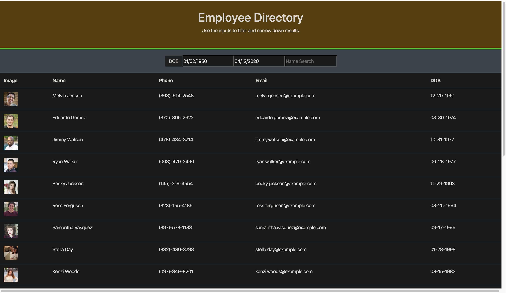
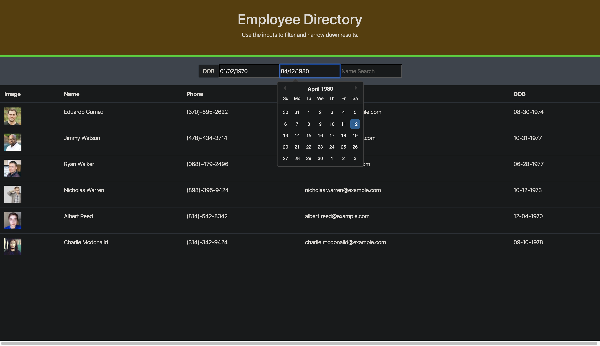
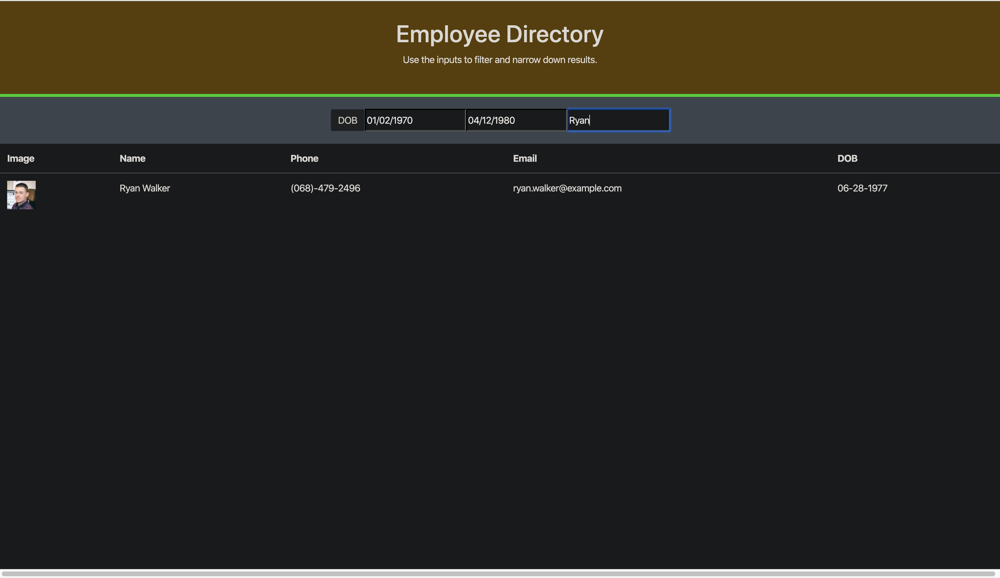

# React-Directory

## Table of contents

- [Deployed Repo](#deployed-repo)
- [Assignment Info](#assignment-info)
- [Technologies](#technologies)
- [Running Pages](#running-pages)
- [Key Notes](#key-notes)

## Deployed Repo

- HTML
  https://all-new-workout-tracker.herokuapp.com/

## Assignment info

In this activity we had to use an employee info API to 
create a React App. From the Api, the only information 
needed for our table was images, names, phone, email and 
date of birth. Initializing states and then setting them 
to change when ever a date of birth range or name is inputted.
Once the API is done loading and the inputs have been read, 
the list should filter out the specific search criteria. 

## Technologies

Project is created with:

- Bootstrap v4.4
- Visual Studios Code (HTML/CSS/JS/JQ)
- Google/W3
- Node.js
- Express
- NPM
- React


## Running Pages

- Here's screen shots of the running page from an images folder:








## Key Notes

- Bootstrap link for html format

```
    <link
      href="https://maxcdn.bootstrapcdn.com/font-awesome/4.7.0/css/font-awesome.min.css"
      rel="stylesheet"
    />
    <link
      rel="stylesheet"
      href="https://cdnjs.cloudflare.com/ajax/libs/twitter-bootstrap/4.0.0/css/bootstrap.min.css"
    />
```

- NPM

* install
* run
* deploy
* start
